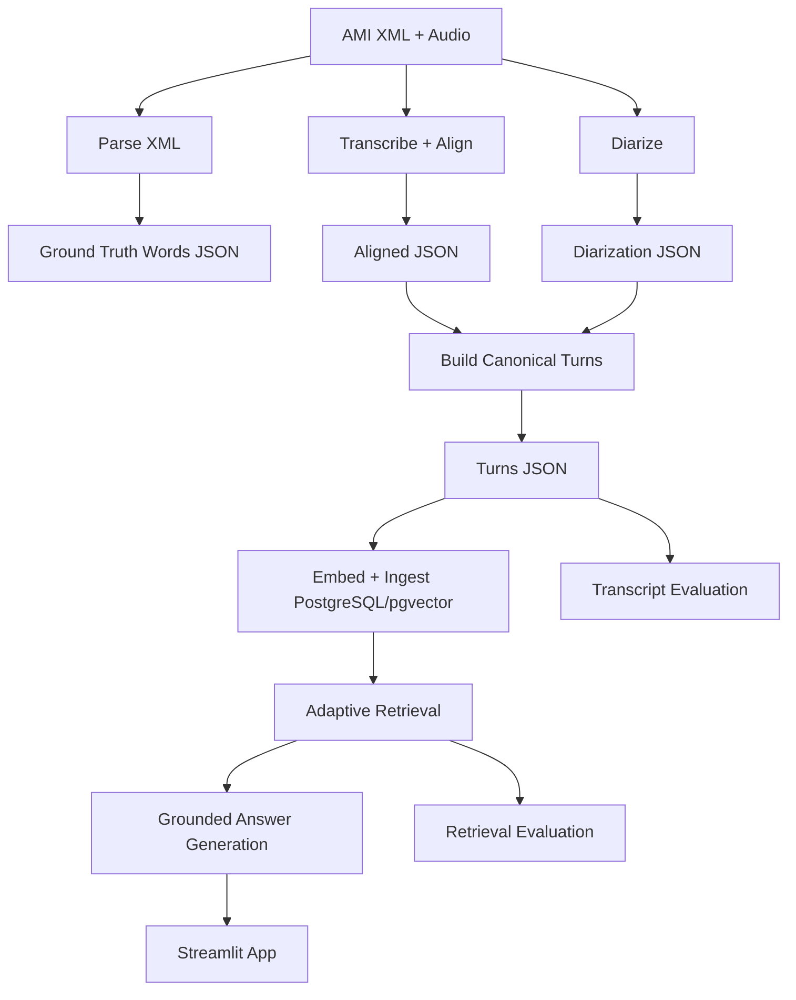

# Meeting RAG Local

[](#running-tests-and-quality-checks)
[](#prerequisites)
[](#getting-started)
[](#deployment--production-notes)

Local-first meeting intelligence pipeline that converts meeting audio into searchable transcript evidence and grounded RAG answers. The project is designed for practical local operation with transparent evidence flow, deterministic artifacts, and testable service boundaries.

## Project Overview

Meeting RAG Local solves a common problem in meeting-heavy teams: extracting reliable answers from long conversations without losing traceability to the original evidence. Instead of relying on opaque summarization alone, the system keeps an explicit path from source artifacts to retrieved chunks to final response sections.

Core outcomes:

- Parse and normalize AMI meeting assets.
- Build canonical speaker turns from alignment and diarization outputs.
- Build derived retrieval chunks (windowed with overlap) from canonical turns.
- Embed and index retrieval chunks in PostgreSQL + pgvector.
- Retrieve evidence adaptively by question intent.
- Generate grounded answer sections with explicit insufficient-context handling.
- Provide a local Streamlit interface for transcript browsing and evidence-aware chat.

Tech stack summary:

- Language and runtime: Python 3.11
- Dependency management: uv
- Data store and retrieval: PostgreSQL + pgvector
- Model integrations: WhisperX, pyannote.audio, Ollama
- UI: Streamlit
- Quality gates: pytest, ruff, black, mypy

## Motivation and Goals (Why)

### Why local-first operation

- Privacy and control: keep data and model calls inside a local environment.
- Operational predictability: avoid external API latency and quota instability.
- Debuggability: easier end-to-end introspection of artifacts and retrieval behavior.

### Why explicit artifact stages

- Every stage creates concrete outputs in data/interim or data/processed.
- Failures become diagnosable by artifact inspection instead of black-box retries.
- Evaluation can compare stage outputs directly against fixtures.

### Why adaptive retrieval modes

Different question intents need different retrieval breadth and constraints:

- Speaker-specific questions benefit from scoped retrieval.
- Decision/action queries need broader evidence than simple factoids.
- Broad summaries need diversity over larger candidate pools.
- Confidence/meta follow-ups can reuse prior turn state for speed and consistency.

### Why structured grounded answers

- Structured sections increase readability for humans.
- Grounded answers reduce unsupported claims by enforcing evidence context.
- Explicit insufficient-context behavior prevents false confidence.

## Features and Implementation Details (What and How)

### 1) AMI parsing and artifact normalization

What:

- Parses AMI word-level XML files into normalized JSON word artifacts.

Why:

- Establishes a stable baseline for downstream alignment, turn-building, and transcript diagnostics.

How:

- Entry point: scripts/parse_ami_xml.py
- Contracts: meeting_pipeline.schemas.transcript
- Outputs: data/interim/<meeting_id>_ground_truth_words.json

### 2) Transcription, alignment, and diarization wrappers

What:

- Runs transcription and alignment against meeting audio, then diarization for speaker segmentation.

Why:

- Combines lexical content with speaker attribution and timing to support trustworthy retrieval chunks.

How:

- Entry points:
  - scripts/run_transcription.py
  - scripts/run_diarization.py
- Wrappers and helpers:
  - meeting_pipeline.audio.whisperx_runner
  - meeting_pipeline.audio.alignment
  - meeting_pipeline.audio.diarization
  - meeting_pipeline.audio.gpu_utils

### 3) Canonical turn construction

What:

- Merges aligned transcript data and diarization segments into canonical speaker turns.
- Preserves canonical turns as source artifacts for browsing and traceability.

Why:

- Keeps a stable turn-level artifact while allowing retrieval-specific chunking to evolve.

How:

- Entry point: scripts/build_turns.py
- Core logic: meeting_pipeline.audio.turn_builder
- Output: data/processed/<meeting_id>_turns.json

Derived retrieval chunking:

- During ingestion, canonical turns are transformed into retrieval chunks using windowed chunking.
- Default settings target broader semantic context:
  - `RETRIEVAL_CHUNK_WINDOW_SECONDS=45`
  - `RETRIEVAL_CHUNK_OVERLAP_SECONDS=15`
- Overlap is deduped with deterministic chunk keys to reduce duplicate explosion.

### 4) Embedding ingestion and persistence

What:

- Builds retrieval chunks from canonical turns, embeds them, and stores them in PostgreSQL.

Why:

- Improves broad-question recall with larger semantic windows while preserving turn artifacts.

How:

- Entry points:
  - scripts/ingest_embeddings.py
  - scripts/ingest_many_meetings.py
  - scripts/run_migrations.py
- Storage and access:
  - meeting_pipeline.db.connection
  - meeting_pipeline.db.migrations
  - meeting_pipeline.db.repository
  - meeting_pipeline.db.pgvector_search

### 5) RAG orchestration with latency controls

What:

- Handles query rewriting, embedding, adaptive retrieval, and answer synthesis.

Why:

- Preserves answer quality while supporting practical latency for local demos.

How:

- Core modules:
  - meeting_pipeline.rag.query_rewriter
  - meeting_pipeline.embeddings.embedder
  - meeting_pipeline.rag.retriever
  - meeting_pipeline.rag.answer_generator
- Performance capabilities:
  - Stage timing metadata per request
  - In-memory caches for rewrite/embed/retrieval/answer paths
  - Optional fast mode with conservative caps and rewrite skipping heuristics
  - Evidence compaction for prompt size control

Rewriter safety behavior:

- Rewritten-query output is sanitized and validated before use.
- Reasoning-style output, boxed/final-answer wrappers, and verbose explanatory output are rejected.
- When rewrite quality is unsafe or poor, the system falls back to the original user question.

Meta-question support:

- Confidence/introspective questions route to `meta_or_confidence` instead of normal topical retrieval.
- Meta handling can review the latest turn or summarize recent conversation confidence state.

Broad-summary support:

- Whole-meeting and broad-topic questions route to `broad_summary` retrieval mode.
- Broad-summary retrieval uses wider candidate retrieval plus speaker/time diversification.
- Broad-summary evidence assembly now dedupes near-identical overlap-heavy chunks.

Confidence tiering:

- Answer confidence is calibrated into explicit tiers:
  - `grounded`
  - `partial_limited_evidence`
  - `insufficient_evidence`
- When evidence is too weak, answers fall back to a concise explicit
  "cannot answer confidently from retrieved evidence" response.

Speaker topical analysis:

- Questions like "Which speaker talked the most about planning?" trigger speaker-level
  evidence aggregation over retrieved chunks.
- The answer includes per-speaker chunk counts and approximate evidence span before
  making a ranked claim.

### 6) Streamlit app and diagnostics

What:

- Provides meeting browser + evidence-aware chat with diagnostics.

Why:

- Gives operators a practical review interface while preserving retrieval transparency.

How:

- UI modules:
  - src/meeting_pipeline/app/app.py
  - src/meeting_pipeline/app/components.py
- Key UX behaviors:
  - Meeting selection and transcript filtering
  - Grounded answer sections and evidence expansion
  - Debug latency and cache summaries
  - One-click whole-meeting summary shortcuts (default and 5-bullet)
  - Fast mode toggle

### 7) Evaluation tooling

What:

- Supports transcript diagnostics and retrieval benchmark diagnostics.

Why:

- Enables measurable quality checks beyond anecdotal UI behavior.

How:

- Entrypoints:
  - run_eval.py (wrapper)
  - scripts/run_eval.py (implementation)
- Core evaluation modules:
  - meeting_pipeline.eval.transcript_eval
  - meeting_pipeline.eval.retrieval_eval
  - meeting_pipeline.eval.metrics

### 8) Operational utilities

What:

- Adds smoke and benchmark scripts for quick verification and latency profiling.

Why:

- Helps validate local readiness and quantify performance tradeoffs.

How:

- scripts/smoke_rag.py
- scripts/benchmark_rag.py
- scripts/report_ami_meeting_readiness.py

## Architecture



Request flow (chat):

1. User question enters app layer.
2. Query rewrite applies context-sensitive normalization.
3. Query embedding is generated (cache-aware).
4. Retriever selects adaptive mode and fetches evidence.
5. Answer generator compacts evidence and synthesizes structured output.
6. Metadata (timings, cache hits, mode) is returned for diagnostics.

## Challenges and Issues Encountered

### 1) Direct script execution import errors

What went wrong:

- Running path-based commands such as uv run python scripts/ingest_many_meetings.py main --turns-dir data/processed failed with ModuleNotFoundError for scripts package imports.

Resolution:

- Added import fallbacks in affected scripts so both module-style and path-style execution work reliably.

Learning:

- Operational scripts should tolerate common invocation styles used by developers and CI helpers.

### 2) End-to-end latency variance in local RAG

What went wrong:

- Repeated and broad queries could feel slow due to repeated rewrite/embed/retrieval/answer work.

Resolution:

- Added stage-level timing metadata, in-memory caches, optional fast mode, retrieval caps, and answer evidence compaction.

Learning:

- Local-first systems need explicit latency controls and observability from day one.

### 3) GPU memory pressure on constrained machines

What went wrong:

- Running heavy model stages concurrently can trigger OOM or unstable behavior on 8 GB VRAM environments.

Resolution:

- Kept stage wrappers explicit, documented sequential operation guidance, and preserved CPU fallback options.

Learning:

- Operational sequencing is as important as model quality for reliable local workflows.

### 4) Tooling consistency across contributors

What went wrong:

- Small style and path differences can break lint gates or script assumptions.

Resolution:

- Enforced quality gates (ruff, black, mypy, pytest) and standardized ignore patterns.

Learning:

- Fast, deterministic checks reduce integration churn substantially.

## Getting Started

### Prerequisites

- Python 3.11
- uv
- PostgreSQL with pgvector available
- Ollama installed and running locally
- Optional for full audio pipeline: CUDA-capable environment and compatible model dependencies

### Setup

1) Clone repository and enter project root.

2) Create environment file.

- Windows PowerShell:

```powershell
copy .env.example .env
```

- Bash:

```bash
cp .env.example .env
```

3) Install dependencies.

- Baseline dev dependencies:

```bash
uv sync --group dev
```

- Full local pipeline dependencies:

```bash
uv sync --group dev --extra data --extra services
```

- Required for transcription and diarization commands below:

```bash
uv sync --group dev --extra data --extra services --extra gpu
```

4) Initialize database.

```bash
# must match POSTGRES_DB in .env
createdb meeting_rag
uv run python scripts/run_migrations.py
```

5) Prepare Ollama models.

```bash
ollama pull nomic-embed-text-v2-moe
ollama pull qwen3:4b

# if Ollama is not already running as a background service, start it in a separate terminal
ollama serve
```

6) Optional retrieval chunk tuning.

```bash
# defaults shown
RETRIEVAL_CHUNK_WINDOW_SECONDS=45
RETRIEVAL_CHUNK_OVERLAP_SECONDS=15
```

### End-to-end pipeline example

```bash
# Requires GPU extras: uv sync --group dev --extra data --extra services --extra gpu
uv run python scripts/parse_ami_xml.py --meeting-id ES2002a --input-dir data/raw/ami --output-dir data/interim
uv run python scripts/run_transcription.py --audio-path data/raw/ami/ES2002a.Mix-Headset.wav --meeting-id ES2002a --output-dir data/interim
uv run python scripts/run_diarization.py --audio-path data/raw/ami/ES2002a.Mix-Headset.wav --meeting-id ES2002a --output-dir data/interim
uv run python scripts/build_turns.py --meeting-id ES2002a --aligned-path data/interim/ES2002a_aligned.json --diarization-path data/interim/ES2002a_diarization.json --output-dir data/processed
uv run python scripts/ingest_embeddings.py --meeting-id ES2002a --turns-path data/processed/ES2002a_turns.json --replace-existing --batch-size 16
uv run streamlit run src/meeting_pipeline/app/app.py
```

Chunking override example:

```bash
uv run python scripts/ingest_embeddings.py --meeting-id ES2002a --turns-path data/processed/ES2002a_turns.json --replace-existing --batch-size 16 --retrieval-chunk-window-seconds 60 --retrieval-chunk-overlap-seconds 20
```

### Useful operational commands

- Batch ingestion:

```bash
uv run python scripts/ingest_many_meetings.py main --raw-ami-dir data/raw/ami --turns-dir data/processed --skip-existing --batch-size 16 --retrieval-chunk-window-seconds 45 --retrieval-chunk-overlap-seconds 15
```

- Multi-meeting discovery plan:

```bash
uv run python scripts/ingest_many_meetings.py discover --raw-ami-dir data/raw/ami --turns-dir data/processed --discovery-source both
```

- Readiness report:

```bash
uv run python scripts/report_ami_meeting_readiness.py --raw-ami-dir data/raw/ami --interim-dir data/interim --processed-dir data/processed --only-missing
```

- Smoke run:

```bash
uv run python scripts/smoke_rag.py --meeting-id ES2002a --question "What decisions were made?" --top-k 5 --debug --preview-evidence
```

- Benchmark:

```bash
uv run python scripts/benchmark_rag.py --meeting-id ES2002a --question "What decisions were made?" --runs 5 --fast-mode
```

### Exact multi-meeting workflow

1. Run readiness check to see missing artifacts:

```bash
uv run python scripts/report_ami_meeting_readiness.py --raw-ami-dir data/raw/ami --interim-dir data/interim --processed-dir data/processed --only-missing
```

2. Process meetings (parse -> transcription/alignment -> diarization -> turns):

```bash
uv run python scripts/parse_ami_xml.py --meeting-id EN2002a --input-dir data/raw/ami --output-dir data/interim
uv run python scripts/run_transcription.py --audio-path data/raw/ami/EN2002a.Mix-Headset.wav --meeting-id EN2002a --output-dir data/interim
uv run python scripts/run_diarization.py --audio-path data/raw/ami/EN2002a.Mix-Headset.wav --meeting-id EN2002a --output-dir data/interim
uv run python scripts/build_turns.py --meeting-id EN2002a --aligned-path data/interim/EN2002a_aligned.json --diarization-path data/interim/EN2002a_diarization.json --output-dir data/processed
```

Repeat step 2 for each meeting ID you want to ingest.

3. Discover candidate meetings and readiness:

```bash
uv run python scripts/ingest_many_meetings.py discover --raw-ami-dir data/raw/ami --turns-dir data/processed --discovery-source both
```

4. Ingest many processed meetings safely:

```bash
uv run python scripts/ingest_many_meetings.py main --raw-ami-dir data/raw/ami --turns-dir data/processed --skip-existing --batch-size 16 --discovery-source both
```

5. Launch app and refresh metadata if needed:

```bash
uv run streamlit run src/meeting_pipeline/app/app.py
```

### Migration and re-ingestion after retrieval chunk update

If upgrading from older turn-level embeddings:

1. Apply latest DB migrations:

```bash
uv run python scripts/run_migrations.py
```

2. Re-ingest meetings with replacement enabled to rebuild retrieval chunks:

```bash
uv run python scripts/ingest_many_meetings.py main --raw-ami-dir data/raw/ami --turns-dir data/processed --replace-existing --batch-size 16 --discovery-source both
```

## Running Tests and Quality Checks

Run full gates:

```bash
uv run ruff check .
uv run black --check .
uv run mypy src
uv run pytest
```

Focused script regression checks:

```bash
uv run pytest tests/test_ingest_many_meetings_script.py tests/test_report_ami_meeting_readiness_script.py -q
```

## Deployment / Production Notes

Current deployment posture:

- Local-first single-operator deployment is the primary target.
- PostgreSQL and Ollama are expected to run in the same trusted environment.

Production considerations:

- Use managed secrets instead of plaintext environment files.
- Keep model/runtime versions pinned across environments.
- Separate long-running GPU stages from interactive UI serving.
- Monitor retrieval latency and cache effectiveness to tune fast mode and top-k caps.
- Treat data/interim and data/processed as regenerable artifacts, not source-of-truth.

## Project Structure

```text
.
├── src/meeting_pipeline/
│   ├── app/               # Streamlit orchestration and rendering helpers
│   ├── audio/             # Transcription, alignment, diarization, attribution, GPU utilities
│   ├── db/                # DB connection, migrations, repository, pgvector search
│   ├── embeddings/        # Ollama client and embedding service
│   ├── eval/              # Transcript and retrieval evaluation logic
│   ├── rag/               # Query rewrite, retrieval orchestration, answer generation
│   ├── schemas/           # Typed artifact contracts
│   ├── config.py          # Typed runtime settings
│   └── cache_utils.py     # In-memory LRU cache utility
├── scripts/               # Operational CLI entry points
├── tests/                 # Unit and script-level tests
├── migrations/            # SQL migration files
├── docs/                  # Architecture, setup, dataset, evaluation, AMI download notes
├── data/                  # Raw/interim/processed/eval artifacts
├── run_eval.py            # Root convenience wrapper for evaluation CLI
└── pyproject.toml         # Project metadata and tool configuration
```

Primary feature locations:

- RAG orchestration: src/meeting_pipeline/rag
- Retrieval database operations: src/meeting_pipeline/db
- End-user app: src/meeting_pipeline/app
- Pipeline operations: scripts

## Roadmap / Future Improvements

- Add optional containerized local deployment profile.
- Expand evaluation fixtures for broader retrieval scenarios.
- Add integration tests for end-to-end artifact generation on sample meetings.
- Add structured telemetry export for latency and cache metrics.
- Improve multi-meeting incremental ingestion observability.
